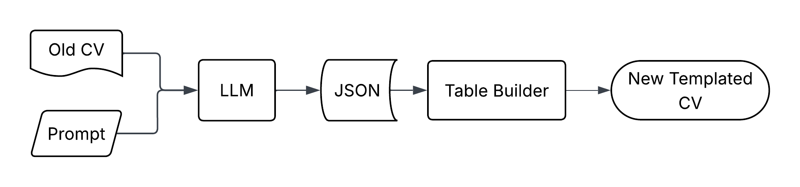

# Introduction

This document serves as a guide to help understand the different components of the system and how they communicate with each other.

Preface:
In this document, whenever a 'user' is mentioned, it is meant that 

<!--toc:start-->
- [Introduction](#introduction)
- [System Overview](#system-overview)
- [LLM Module](#llm-module)
- [Table Builder Module](#table-builder-module)
  - [Table Components](#table-components)
  - [Builder](#builder)
- [Translation Unit](#translation-unit)
<!--toc:end-->

The aim of this software is to make the process of mass transferring CVs as seamless as possible.
What this means is the following:

Let's say there are ten different CVs with different templates, and all these must be transferred to one common template/format.
This can be done by manually finding, copying, and pasting each piece of required information from the old CV to the new template ... ten times.

This is where this software comes in. It provides a framework to follow in order to create a tool that automatically extracts information and uses it to create a complete CV.
This piece of software provides an almost-ready tool that automates the process of CV transfer where all the user needs to do is (programmatically) create a template,
as well as provide an interface with a Large Language Model (LLM).

For a fully functioning tool that uses this software framework, see the [BuildImpl](/BuildImpl) file.

# System Overview

As previously mentioned, the system is completely modular. The different modules constituting this software are the following:
- LLM Invoker Module
- Table Builder Module
- Translation Unit

Before getting into details about the different modules, an overall picture is needed.

Diving deeper into the implementation, the construction of a CV document should also be modular.
To satisfy this requirement, the software will be designed such that the document is composed of tables placed one after the other.
Every component in the document will be treated as a table. A paragraph is a table, a line is a table and, of course, a table is also a table,
all with a different number of rows, columns, and different formatting.

Based on these rules, the different modules previously mentioned will be pieced together to form a pipeline. It works as follows.
The LLM Module is first in line. It sends the CV's data along with a prompt to an LLM asking it to extract certain pieces of data and placing them in a JSON object.
With this step complete, the LLM Module's duty is also complete. This data stored as a JSON is archived, and the Table Builder Module is called.

The Table Builder Module provides a pseudo-syntax of programmatically creating a CV template using Python code.
Using this, the user of BeyondCV can create a template which is internally converted into a list of the different tables containing the CV profile's data.
These tables are then read by the Translation Unit.

The Translation Unit takes the tables and 'translates' them into a full document. These can be for different document types, but the one currently supported is Docx files.

Each of the above mentioned modules will be better explained in the sections to come.

A full overview of the pipeline is shown below:

# LLM Module
The LLM module takes in the PDF and a hardcoded prompt to extract all required information.
The LLM module outputs a JSON object that can then be fed into the Table Builder.

The PDF is first parsed and ONLY text is extracted. This text is passed to the LLM and an output is received.

# Table Builder Module
The function of this module is to 'build' the tables that are the abstract representation of the complete CV.

The Table Builder module consists of two submodules:
- Table Components
- Builder

## Table Components
This module contains the definitions of the elementary pieces with which the tables are made.
These components are the following, and they exist with the following hierarchy:

**Table**:
- A list of Rows

**Row**:
- A list of cells
- Row minimum height

**Cell**:
- A list of paragraphs: each paragraph is a block of text to be added to the cell.
- Cell configuration

**Paragraph**:
- Text
- Paragraph configuration

**Cell Configuration**:
- Width
- Colour
- Position of cell contents

**Paragraph Configuration**:
- Font Name
- Font Size
- Bold
- Italic
- Underline

**Hierarchy Overview**:\
Paragraph -> Cell -> Row -> Table

## Builder
This submodule does all the heavy lifting. In this module, there are four main types that are defined:
- CV Template
- Section
- Repeating Section
- Page Break

These types are abstractions of the building blocks which are the components mentioned above.
<!-- CONTINUE HERE -->

The number of rows and columns shall be calculated dynamically. This is done by having the table be created by adding rows to an empty table object.
Each row added can have an arbitrary number of columns.

# Translation Unit
This takes in the table classes from the table maker and acts as an interface, translating to whatever output file type is required.
The main output types will be Docx and TeX files.
